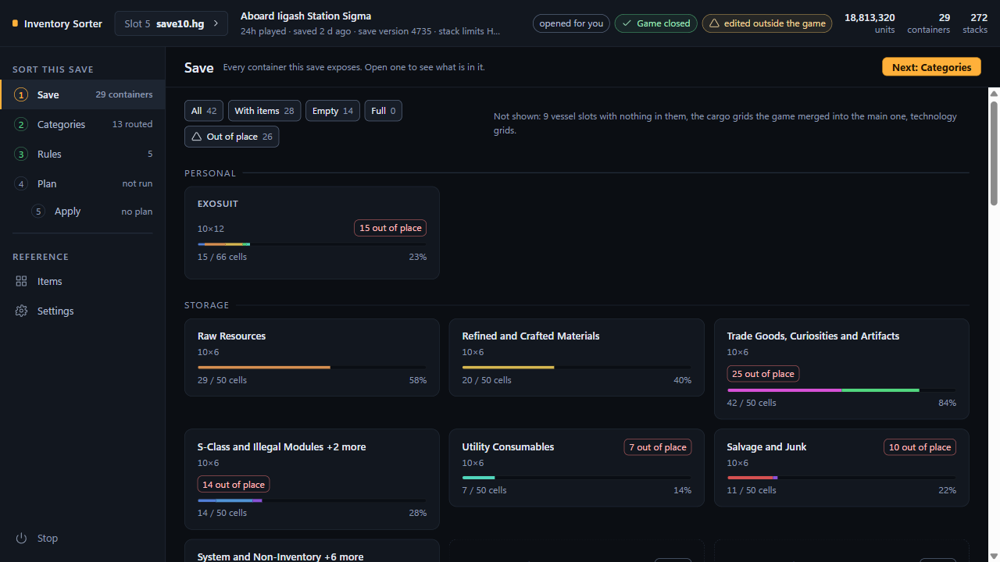

# NMS Inventory Sorter

A local web page that reads one No Man's Sky save, shows every container, and
lets you say which category of item goes where. It shows exactly what would
move, and writes it only after proving it can do so safely. It moves what you
already have: no spawning, no stat editing, no unit editing.

## Install

**The release zip.** Download `NMS-Sorter-<version>-win64.zip` from the
release page, unzip it anywhere, and double-click `NMS-Sorter.exe`. It opens
the page in your browser. No Python, no terminal, nothing installed. The zip
also holds `NMS-Sorter-console.exe`, which is the same program with a console
window for when something goes wrong, and this README with the guides beside
it.

Windows SmartScreen will probably say "Windows protected your PC", because the
build is not code-signed. Click "More info", then "Run anyway". If you want to
check the download first, `SHA256SUMS` in the zip lists each file's hash and
`TROUBLESHOOTING.md` shows how to compare it.

**From source** (Linux, macOS, or Python on Windows): see
[docs/SOURCE.md](docs/SOURCE.md).

## First run

The first page asks one question, "Which folder holds your No Man's Sky
saves?", and looks in exactly one place to answer it:
`%APPDATA%\HelloGames\NMS`.

| Where you play | The folder |
|---|---|
| Steam | `%APPDATA%\HelloGames\NMS\st_<your steam id>` |
| GOG | `%APPDATA%\HelloGames\NMS\DefaultUser` |
| Microsoft Store / Game Pass | not supported; the save is in a container format this tool has never seen |

If several folders are found they are all listed with their newest save's
summary and play time, and none is chosen for you. If none is found, or the one
offered is the wrong account, paste the folder into the field on the page. Give
it the **folder** that holds `save.hg`, `save2.hg` and their `mf_` partners,
not one of the files.

## The job, in six steps

Sort while the game is open. That is the normal way to use this: you never
have to close No Man's Sky, only step out of the save.

1. **Save in game**, then **Options > Quit to main menu**. Stay on the menu:
   do not load anything.
2. **Choose the save** in the picker at the top of the page. Only the save you
   select is read.
3. **Route the categories** on the Categories section: each category gets a
   destination container, and a second destination takes the overflow. Check
   the **Sources** list too, because only what sits in a source can move.
4. **Run a dry run** on the Plan section. It writes nothing and says what
   would move, out of which container, into which cells, and which rule
   decided it.
5. **Apply.** Tick "I have read the plan above." and, while the game is
   running, "I am at the main menu, not in a loaded save". Then press **Apply
   this plan**.
6. **Load the save in game.** An edited file changes nothing until the game
   next reads it.

With the game closed it is the same without step 1, and the second tick is not
shown at all.

**Not from a loaded save.** In a loaded save the game holds its own copy in
memory and writes it out on its own schedule, so whichever writes last wins:
your edit can be lost, or it can overwrite play. That is why the tick is asked
for, and applying without it is refused.

## Stopping it, and getting the page back

- **Stop the sorter**, at the foot of the Settings section.
- **Stop**, at the foot of the rail, from any section.
- by itself, after 30 minutes with no request from the page
  (`idle_exit_minutes`; 0 keeps it running until you stop it).
- ctrl-c in the window, if you started `NMS-Sorter-console.exe`,
  `packaging\start.bat` or `python -m nms_sorter`.

To get the page back, double-click `NMS-Sorter.exe` again. A second launch does
not start a second server: it opens the page of the one already running and
closes itself.

## Safety, in six lines

**No guarantees. A save editor can corrupt a save.** Before anything is
written, this tool copies the save and its metadata file into a timestamped
backup folder and verifies the copies by hash; the Backups card restores one in
a click. Keep your own copies too.

1. The save and its `mf_` metadata are copied to a timestamped folder and
   hashed before anything is written, with a `manifest.json` recording what the
   copy is.
2. The save is proved to re-serialise byte for byte before a single field is
   edited. A file this tool cannot reproduce exactly is a file it does not know
   enough about to edit.
3. Apply runs from the main menu or with the game closed, never from a loaded
   save, and refuses just as hard when it cannot tell whether the game is
   running at all.
4. Nothing outside the containers your plan named is allowed to change; a
   single stray difference anywhere in the document aborts the write.
5. Restore is one click, and it refuses to discard play: if the game has
   written to the save since the backup was taken, Undo is greyed out and says
   why.
6. A save version this build has not been verified on plans with a banner and
   applies anyway, under the checks above. `strict_version_check` makes it a
   refusal instead.

## What it refuses

| Situation | What happens |
|---|---|
| Apply on Linux or macOS | refused: the process check needs Windows. Browsing, planning and the dry run all work |
| An expedition save | refused at plan time |
| An `mf_` format other than 2004 | refused before anything is written |
| A save older than Waypoint (4.0) | refused by name, with the version it found |
| Microsoft Store / Game Pass | not supported |
| Console and Switch saves | not supported |

## Where things live

`%LOCALAPPDATA%\NMS-Sorter\` holds everything this program keeps:

| Path | What |
|---|---|
| `settings.json` | the eight settings |
| `config.json` | your rules, with the five previous revisions beside it as `.bak.1` to `.bak.5` |
| `config.before-reset-<stamp>.json` | the rules **Start over** replaced, one file per time you started over or put a kept one back; never deleted, never rotated |
| `backups\` | one timestamped folder per apply |
| `logs\sorter.log` | the log |
| `runtime\` | where the one-file executable unpacks itself |

While a write is in progress there is also a lock file and a temp file beside
the save, in the game's own folder. Both go away when the write ends.

## Update

Unzip the new build over the old one. Your settings, rules and backups live in
`%LOCALAPPDATA%\NMS-Sorter\` and an update does not touch them.

## Uninstall

Stop it first, from the Settings section or **Stop** in the rail: the one-file
build holds its own folder open while it is running. Then delete the
executables and delete `%LOCALAPPDATA%\NMS-Sorter`. There is no installer and
nothing in the registry.

## Documentation

| Document | For |
|---|---|
| [docs/GUIDE.md](docs/GUIDE.md) | first run, your first sort, every section |
| [docs/SOURCE.md](docs/SOURCE.md) | running it from source instead of the executable |
| [docs/RULES.md](docs/RULES.md) | every config key, rule mode and validation message |
| [docs/TROUBLESHOOTING.md](docs/TROUBLESHOOTING.md) | look up the message you saw |
| [docs/POST-PATCH.md](docs/POST-PATCH.md) | what to do when the game updates |

## Licence

MIT for the code. `nms_sorter/data/` is a derived index of data that ships with
No Man's Sky; Hello Games owns the underlying data, and the generator is
shipped in `tools/` so you can rebuild it. See [LICENSE](LICENSE).

Not affiliated with Hello Games.
