# Guide

Audience: the player, and the tinkerer. `README.md` covers installing and
stopping it; this is what to do once the page is open.

## 1. First run

The first page asks one question:

> Which folder holds your No Man's Sky saves?

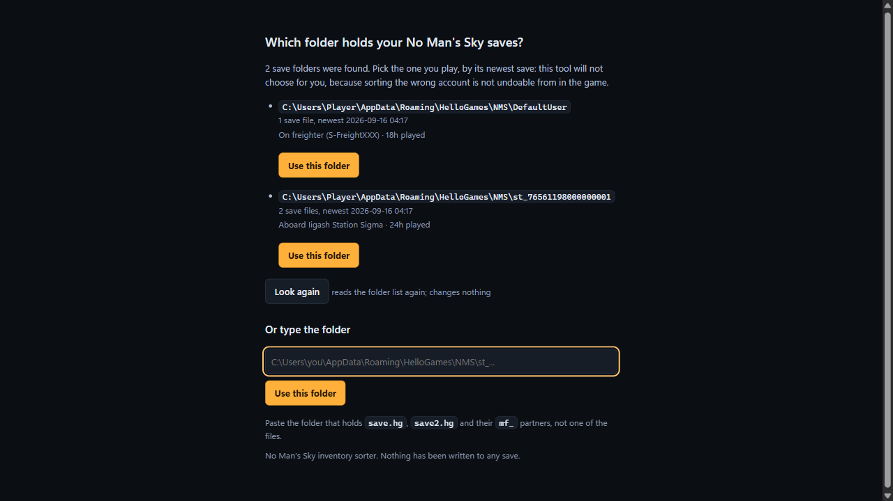

To answer it the sorter looks in exactly one place,
`%APPDATA%\HelloGames\NMS`, and lists the folders there named `st_*` or
`DefaultUser`, plus the root itself if you have hand-copied saves into it. Each
row shows how many save files it holds, when the newest was written, and the
newest save's own summary and play time, which is the line that tells two Steam
profiles apart: `Aboard Iigash Station Sigma` beside `24h played` is something
you recognise, and `st_76561198000000001` is not. No save file is opened to
render that page.

- **One folder found**: it is offered with a **Use this folder** button.
- **Several found**: all listed, and none chosen for you. Sorting the wrong
  account is not something you can undo from inside the game.
- **None found**: the page says "No No Man's Sky save folder was found." and
  names the three layouts it knows: Steam at
  `%APPDATA%\HelloGames\NMS\st_<your steam id>`, GOG at
  `%APPDATA%\HelloGames\NMS\DefaultUser`, and Microsoft Store / Game Pass,
  which is **not supported**, because that save is in a container format this
  tool has never seen.

**Look again** is on every branch of the page. It re-reads the folder list
without a restart, which is what you want after plugging a drive in or copying
a folder into place. Several rows all read "Use this folder", so each one also
carries the folder's own path as its accessible name; a screen reader announces
which offer it is on.

### If the folder it offers is not the one you want

**"Or type the folder" is always on the page**, whether one folder was found,
several were, or none. The offer is only ever an offer. Use the field when your
saves are on another drive, when the folder is not named `st_...` or
`DefaultUser`, when you have two accounts and it offered the wrong one, or when
you are working on a copy rather than the live save.

Paste the path and press the **Use this folder** button beside the field. There
is no folder-browsing dialog; a pasted path is the whole mechanism.
`--folder PATH` does the same thing for one run and is never written back into
`settings.json`, so it is the tool for a one-off and the field is the tool for
the folder you always use.

Give it the **folder** that holds `save.hg`, `save2.hg` and their `mf_`
partners, not one of the files. Two things can be wrong with a path and they
get separate sentences: "There is no folder at ..." means the path is not there
at all, and "That folder holds no `save*.hg` files" means it exists and holds
no saves. Either way your setting was not changed.

The page needs no JavaScript. The folder list is rendered by the server and the
buttons post an ordinary form; the small script on it only re-runs the probe
when you press **Look again**.

### If the folder you chose goes missing

A save folder recorded in your settings that is not there any more gets its own
page, headed with the path: "The save folder E:\NMS saves is not there." An
unplugged drive is the usual cause. There is one button, **Look again**, and
**Choose another folder** is a link one click further away with nothing
pre-selected. It is deliberately not the first-run page: a missing folder is
not a reason to offer you a different account behind a **Use this folder**
button.

### If your settings file is unreadable

The sorter starts anyway, on the shipped defaults, and says so on the page: the
Settings section shows the sentence naming the file and the reason. Press
**Save settings** to rewrite it from what is on screen. One consequence worth knowing:
a run that fell back to defaults will not adopt a sorter already listening on
the default port, because that other sorter may be pointed at a different save
folder. You get your own on the next free port.

## 2. Your first sort

**Leave the game running.** The documented way to use this is from the game's
own main menu: in game, save; **Options > Quit to main menu**; stay on the
menu and do not load anything; sort; then load the save again. On the menu the
game is not writing your save, and you never have to close it.

With the game closed it works the same way and asks for one tick instead of
two. What is refused is applying from a *loaded* save: there the game holds its
own copy in memory and writes it out on its own schedule, so whichever writes
last wins, and your edit can be lost or can overwrite play. No process check
can tell a menu from a loaded save, so the Apply card asks you.

The save picker at the top left reads **Slot 5  save10.hg**; pressing it lists
every save the folder holds, with the game's own timestamp, slot, play time and
location, so you can tell them apart without opening any of them. Beside it,
the header names the save you have open: its own summary line, then its play
time, stamp, version and stack limits. Only the save you select is read. Every
time on the page is your machine's local time and says which zone that is.

The **Save** section shows the containers that hold items: the exosuit, ships, the
freighter, the corvette, storage chests, the Nutrient Processor. **Technology
grids are not shown**, in the Save section or in any picker, because nothing is
ever sorted into one: a grid's cells are fixed by the machine, adjacent modules
of the same family boost each other, and supercharged slots are specific cells.
The model still knows about them, so a hand-edited rule naming one is refused
rather than quietly ignored.

**One vessel, one box.** A vessel is one box headed by its name, with a card
per grid it actually has. Nearly always that is one card and no sub-heading:
Waypoint (4.0) merged the exosuit's and every starship's cargo grid into the
main one, and although the save still carries the empty node, it has no cells
and the game gives you no way to add one, so nothing can ever be in it and it
is not drawn. The freighter is the one vessel that can still have two, and
there both cards are headed with the game's own word for that tab.

Rules and configurations that name a merged grid -- `suit_cargo`, `ship0_cargo`
-- stay valid and do nothing. The keys never change, so nothing needs editing.

**A starship slot you do not own is not drawn at all.** The save carries twelve
starship slots and seven exocraft slots whether or not there is anything in
them. For a starship the hull decides it: a slot with no hull is not a ship,
even when it still has the cells the ship you traded away had. A ship with
cells and nothing in them is a ship, and is drawn. What is not drawn is
summed up in one line under the filter chips.

A ship you renamed in game shows your name. One you never renamed has no name
in the save at all, so it is named by its hull and its slot, "Sentinel
Interceptor 4"; a hull this build does not recognise stays "Starship 4". The
exocraft are named by the game's own vehicle order, Roamer through Minotaur.
The ship and the exocraft you are currently in carry an **in use** tag. Any of
these can be renamed on its card, which is display only and changes nothing in
the save.

**Stellar Extractor Cores** are their own section, **Stellar Extractors**, at
the end of the Save section. They used to sit under Fleet, beside the freighter
and the Corvette, and a core is neither of those: it is a mining buffer in a
freighter base room. Below the sections, the fold headed **Stellar Extractor
Cores** holds the detail, and its summary line says how many cores there are,
what they hold and that they are read-only. Inside it, each core card lists
every substance it holds, the Chromatic Metal and the four gases, with the
amount and the buffer cap per substance, and the block above the cards totals
each substance across every core. Each card also names the room it sits in --
the number on the card is the `extractorN` a rule names -- and its tooltip
names the buffer in the save it came from, which is the thing to quote in an
issue. They are machinery records rather than storage: the sorter never writes
to one, and it drains them only when a rule names one as a source. The fold
stays closed unless the cores hold something.

A core also holds one hidden row that is the extractor itself rather than
anything it mined. It is not inventory and is not shown, counted, or reported
as left alone, so a core card counts substances rather than cells and a plan
that drains every core says nothing about the machinery. The substances are in
one order on every card, Chromatic Metal first and then the gases by name, so
one core can be read against the next.

Rebuilding an extractor room leaves its old buffer behind in the save, so a
played freighter has more buffers than rooms. Each buffer is matched to the
room it stands in, and where two claim one room the one the game last updated
wins; the leftovers are counted under the cards as ignored and are never
drained, because the game has stopped reading them and moving their contents
would duplicate items rather than move them.

**You already have a layout.** A fresh install writes a default configuration
routing thirteen categories into ten chests and the Nutrient Processor, and
carrying five per-item rules. A new configuration written for the save you have
loaded drops any rule that names a container this save does not have, so you do
not start with ten errors about chests you have never built. Section 8 writes
that default layout out as JSON, under "Ten chests".

### Start over

The **Start over** card in the Settings section puts that shipped layout back.
The button asks once, in the page, and names what happens: the configuration
you have now is kept as `config.before-reset-<date>-<time>.json` beside
`config.json`, the shipped Ten chests layout replaces it, and any dry run is
discarded. The card then names the file it kept.

Every configuration kept that way is listed in the same card, newest first,
with its layout name and when it was last saved, and each row has a **Use this
one** button that makes it the configuration in use again -- keeping the one
you have now the same way. Starting over and going back are the same two
clicks in either direction, and nothing in that folder is ever deleted. The
kept files are deliberately outside the `config.json.bak.1` to `.bak.5`
rotation, which shifts on every save and would have pushed the file you
started over from off the end after five edits.

Both buttons refuse while an apply or a restore is running, and refuse if
another tab, or another copy of the sorter, saved the configuration after this
page loaded it. The second says so and offers **Reload from disk**: take the
other copy's configuration, then press again.

The three-step card headed **"Nothing is routed yet"** is what you see instead
when nothing is routed at all, which happens after you unroute everything or
paste a configuration with an empty `bucket_rules`. Each step is a link to the
thing it asks for.

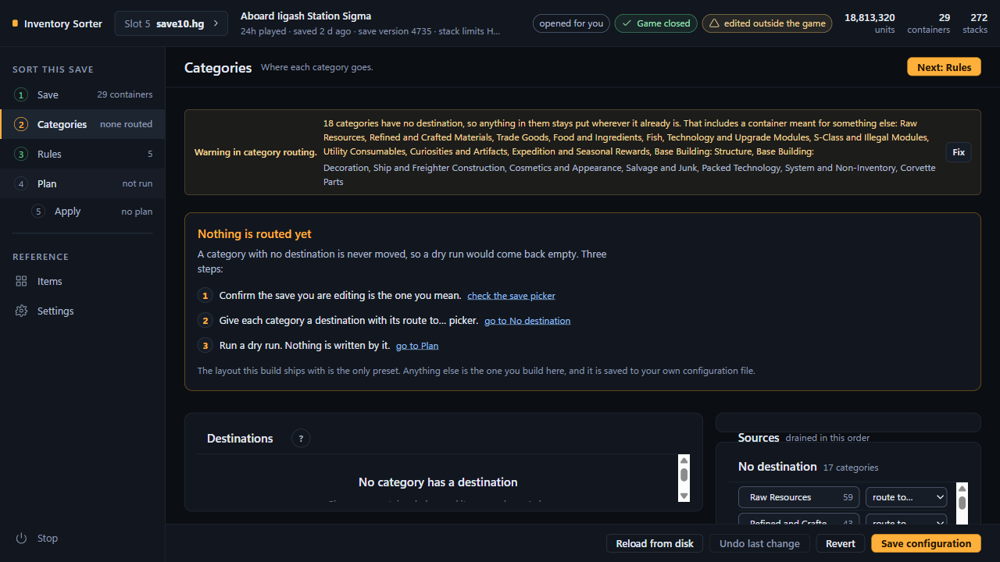

**Step 1: confirm the save you are editing is the one you mean.** The link is
"check the save picker". If the wrong profile is selected, this is the moment
to notice.

**Step 2: give each category a destination.** The **Categories** section is a
list, one row per container that receives something, under the heading
**Categories it receives**. On a window about 1100 px wide or wider it is two
columns; narrower than that the second column reflows underneath. A category
with nowhere to go is
listed in the **No destination** card, in the right-hand column under Sources.
That card is a fold and starts closed, so the Sources list above it has the
room: press its heading to open it, or press **Fix** on the routing warning,
which opens it for you. Each category in it has a "route to..." picker; choose
a container and the category is routed there. Every row also carries a **+** button that opens a category picker, so a
container can be given a second category from its own row, and a category can
be given a second container by adding it to another row. The second one takes the overflow when the first is full, and the
numbered badges on the chips show that order. Each chip has a remove button for
that one link, and **Remove from everywhere** at the foot of the No destination
card takes a category off every container at once. Dragging a chip works
everywhere a picker does, and neither is the only way to do anything.

A category you leave unrouted is never moved by a category rule. That is a real
choice and not an unfinished one, so the page says so rather than nagging.

**Then check Sources.** Beside the table, the **Sources** card is "drained in
this order". Only what sits in a source can move. A category
routed to a chest moves nothing if the chest you are carrying it in is not a
source, and that is the single most common reason a dry run comes back with
fewer rows than expected. The default sources are the Exosuit, the starship in
slot 1 under whatever name it carries, the Freighter and Corvette Storage.

**Save it.** Press **Save configuration** in the bar at the foot of the
section. The warning block at the top **recomputes as you edit**, so a category
you have just routed stops showing as unrouted straight away, without a save.
**Undo last change**, **Revert** and **Reload from disk** are beside the save
button. That bar belongs to the Categories and Rules sections and is docked
below them, so it can never sit over a control.

**One tab at a time.** If another tab, or another copy of the sorter, saved the
configuration after this page loaded it, the save is refused rather than
allowed to overwrite: "the configuration was saved by another tab (or another
copy) at ... after this page loaded it; reload from disk, then redo your
change". Press **Reload from disk** and make the change again.

**Step 3: run a dry run.** The link is "go to Plan"; the button there
is **Run dry run**. It writes nothing. It says what would move, out of which
container, into which cells, and which rule decided it, and it prints a
fingerprint. Read the summary first: the per-row detail is folded behind "the
detail: N move rows" until you want it.

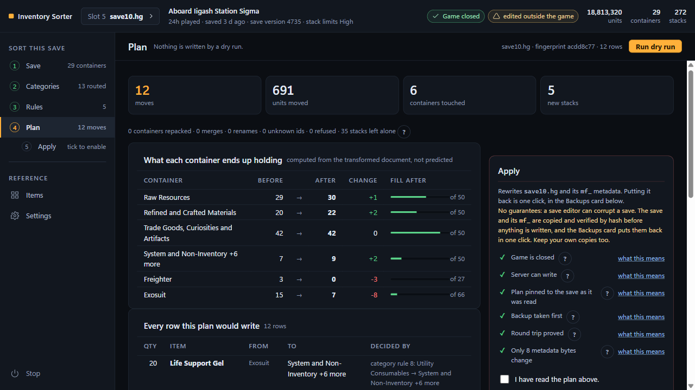

Some warnings carry a **Fix** button. Read what the button says it will do
before pressing it: on the unrouted-category warning it is "show me the
categories with no destination", which scrolls you to them rather than routing
anything for you.

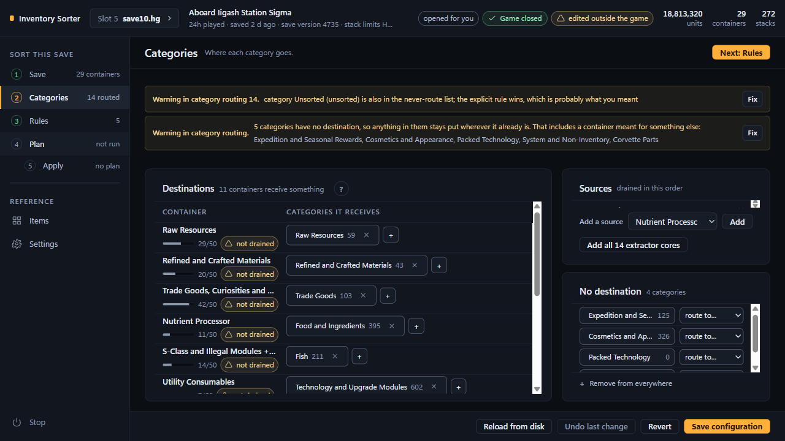

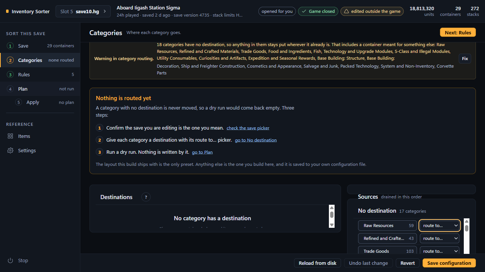

Every per-item rule **is** that sentence: the row reads "keep 250 Sodium in
every source", with "and the rest follows its category" under it, and the words
in boxes are the controls. It is built from the same fields, in the same order of
precedence, that the planner reads, so the row cannot describe something the
run will not do.

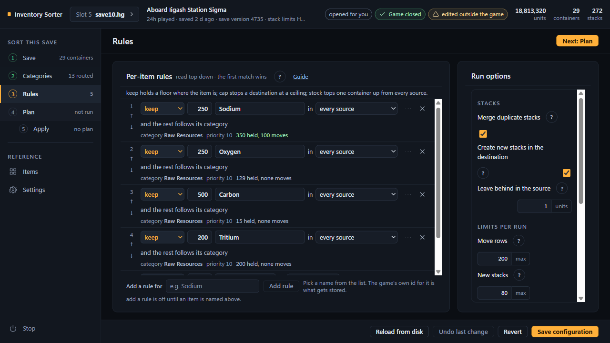

One line above the rule list names all three, so you do not have to press
anything to learn the difference:

> keep holds a floor where the item is; cap stops a destination at a ceiling;
> stock tops one container up from every source.

The two sentences people get wrong are behind the **?** on the **Per-item
rules** card header, and section 3 below has the long form, which the **Guide**
link beside that **?** opens:

> **keep does not fetch.** A keep of 800 while you carry 141 moves nothing; it
> only stops those 141 leaving. To pull the missing 659 out of storage, use
> **stock**.

> **keep and cap are different ends.** keep guards the source an item leaves;
> cap guards the destination it arrives in.

The longer explanation of all five modes is one click away, under "What keep,
cap and stock mean".

Nothing destructive is one click. Removing a rule or a custom category,
unrouting a category everywhere, bulk re-categorising and reverting all ask on
the spot, and say what they take with them.

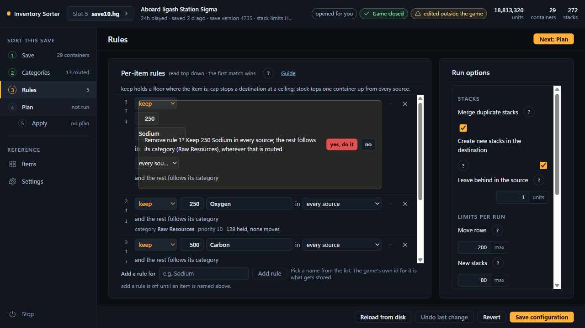

Revert names what it discards, rather than asking "are you sure?" about nothing
in particular.

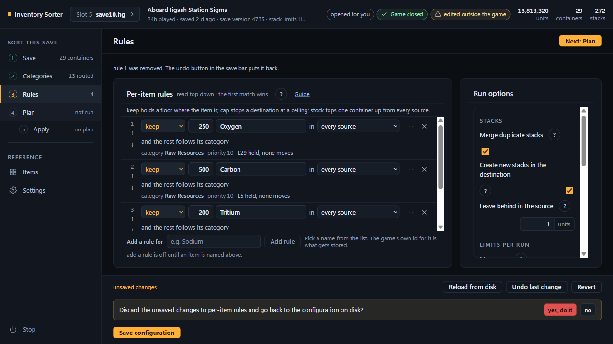

After you say yes, the toast carries an undo for ten seconds.

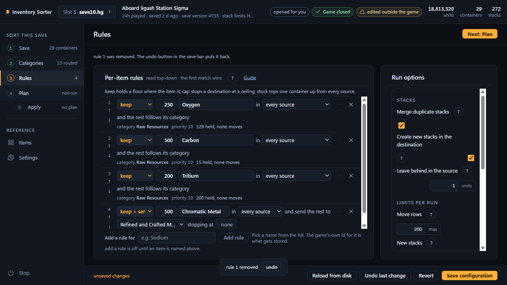

Only the Apply card writes anything, and only after six gates and a timestamped
backup. It opens with the one warning this tool makes: no guarantees, a save
editor can corrupt a save, and here is where the copy of it goes. The gates are
listed with a tick or a cross each, and each carries a "what this means" link
into this repository's documents.

**Apply this plan** stays disabled until you tick **"I have read the plan
above."** While No Man's Sky is running there is a second tick, **"I am at the
main menu, not in a loaded save"**, and the button stays off until both are
ticked; with the game closed the second one is not shown at all. Either tick is
cleared whenever the thing it was about changes -- a new plan, another save, a
saved configuration -- and the reason is printed beside it.

Press it and the write steps appear one line at a time, ending in "Written.".
The first step is the game itself: "closed", or "running as pid ...: at the
main menu, as confirmed", and that line goes into the backup's `manifest.json`
too. It records what the step saw, not what the run went on to do, so a refused
run's manifest carries the same line.

Applying consumes the plan. Afterwards the summary is gone, the third gate
reads "No plan yet", and the tick is cleared with "the tick was cleared because
this plan has been applied. Read the plan above and tick it again." -- "the
ticks were cleared ... tick both again" while the game is running, where two
were shown. That is not
an error; a plan belongs to the bytes it was computed from, and those bytes
have just changed.

Then load the save in game -- from the main menu you are already on --
because an edited file changes nothing until the game next reads it. The
header will say "sorted by this tool at ..." rather than warning
that something other than the game wrote to the file, because the file still
matches the hash the apply recorded.

**If you want it back**, the result card carries **Undo this apply**. Section 6
covers it.

## 3. Rules explained

A per-item rule overrides the category rules for one item, and there are five
kinds.

| Mode | What it does |
|---|---|
| pin | never moves the item, whatever any category rule says |
| keep | holds a number back where the item already is and hands the surplus to the category rules, so it goes wherever that category is routed |
| send all | ignores the category and moves everything to one named container |
| keep + send | holds a number back and sends the surplus to one named container |
| stock | keeps one container topped up to a number by pulling from every source, never drains it below that number, and sends anything above it onward, to a destination you name or to the item's category if you do not |

You add one in the **Rules** section, under **Per-item rules**. Type a name
into **"Add a rule for"** and pick the item from the list that drops down; the
button beside it stays off until an item is named, and it says so: "add a rule
is off until an item is named above." The game's own id is what gets stored,
never the display name. The new row is a sentence: the first box is the verb,
and changing it rewrites the rest of the sentence into the shape that verb
needs. Priority, max per run and note are behind the **...** button.

Under each row is a meta line carrying the read-only facts: the item's own
category, the priority, and what the rule would do to the save you have loaded
right now. The game's own id is on the item button's tooltip -- "Sodium, which
the save stores as CATALYST1" -- and that is where it is everywhere except the
Items table, whose **ID** column is labelled and is what **Search name or id**
searches. Read the sentence rather than counting
fields: it is built from the fields the planner reads, so it is the thing that
will actually happen. `docs/RULES.md` maps every phrase in it back to a
field.

### `keep` does not fetch anything

`keep` is a **floor**, not a target. It holds a number back where the item
already is and nothing more. It never moves anything **in**.

A keep of 800 while you are carrying 141 moves nothing: it only stops those 141
leaving. It does not go and get the missing 659 out of a chest. If that is what
you wanted, you wanted `stock`.

The picker beside the number says **which source the floor guards**. Pick one
("in Exosuit") and the floor binds there only, while every other source drains
in full. Leave it on "in every source" and the same floor is held back in each
source separately, which is rarely what anyone means: four sources and a keep
of 250 is 1,000 units held back, in four places.

### `stock` is the two-sided one

`stock` is the one that fetches. "Always have 800 Chromatic Metal on me, bank
the rest" is a `stock` rule and nothing else expresses it.

Two things have to be true or it does nothing:

- **the container being stocked must itself be a source**, or there is nothing
  to hold back, because a non-source is never drained in the first place.
- **the container the surplus goes to must be a source too**, if you ever want
  the surplus to come back out. The "Suit floors with a junk box" example in
  section 8 names both `suit` and `chest1` for exactly that reason.

The stock picker on the page lists only your sources, because a container you
stock has to be one of them or the rule is silently inert.

### `cap` guards the destination; `keep` guards the source

They are opposite ends of the same move.

- **keep 250** means "leave 250 behind where it is".
- **cap 500** means "stop once the destination holds 500 of this item, even if
  the source still has more".

A blank cap means no ceiling. Both can be set on one rule, and then whichever
binds first is the one that stops the move.

### Overflow chains: one category, several containers, in order

Routing the same category to a second container does not replace the first. The
destinations are collected in the order you added them, each is filled as far as
it will go, then the next is tried. The numbered badges on the chips are that
order, and the container card shows its place in it, `Raw Resources 2/2`.

Only an exact repeat of the same category and the same container can never
fire, and that is an error rather than a warning:

> bucket \<b\> is already routed to \<store\> by rule \<n\>; this exact pair can
> never fire

A leg that is already full is not a failure. It is the reason the next leg was
used, and the dry run says so per leg.

### An unrouted category is not inert; its items never move

A category no rule names is **never routed**. Its items are left exactly where
they are, including where that is the wrong chest. The page states it rather
than nagging:

> \<n\> categories have no destination, so anything in them stays put wherever
> it already is. That includes a container meant for something else: \<names\>

That is a warning and not an error, because leaving a category alone is a real
choice.

The trap is the opposite direction: an item routed nowhere is **pinned**, not
merely unhandled. If you are waiting for something to move and it never does,
check whether its category has a destination at all before you look at anything
else.

## 4. Items and categories

Every item the table knows about has a category, and the Items section is where you
see and change it.

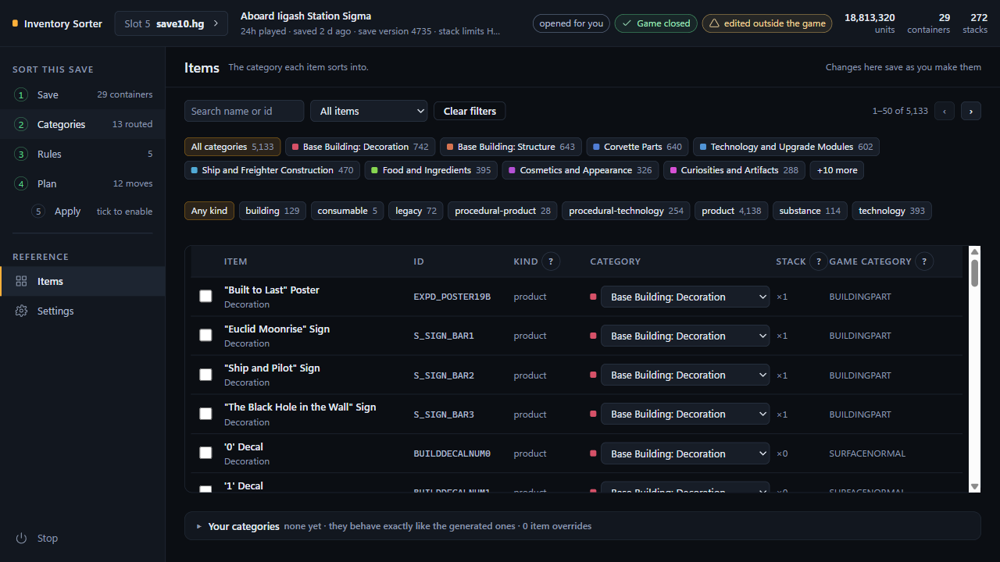

### Finding an item

The chips across the top filter by category and by kind. The search box narrows
whatever the chips have selected, rather than searching everything again, so you
can pick a category first and then type. Three filters are worth knowing:
**only my overrides** shows the rows you have changed, **only Unsorted** shows
the items the table does not know what to do with, and **only procedural** shows
the generated ids, the ones with a `#hash`.

The columns are **item**, **id**, **kind**, **category**, **stack** and
**game category**. **kind** is what the game's own tables call the row
(product, substance, technology and so on). **category** is ours, and is the
thing that decides where an item is sorted. **stack** is the multiplier the game
applies to the container's base stack size, shown as `×4`.

The last column is the odd one. It is labelled **game category**, but what
it prints is the game's own classification string for the item:
`BUILDINGPART`, `CONSUMABLE`, `EXHIBITBONE`. That string is what our category
was learned from. The generated category itself, the one a reset goes back to,
is named by the **"reset to ..."** button that appears in the same cell once you
have changed the row.

### Changing one item's category

Each row has a category select. Choosing a different one stores an override **in
your configuration**. The generated taxonomy is never edited: it is regenerated
from the game's own data after a patch, and anything written into it would be
lost. Because the override is yours, it survives every regeneration.

A row you have changed offers **"reset to \<original\>"**, which removes the
override rather than setting the value back by hand. That distinction matters:
an override that happens to match the default is still an override, and a later
regeneration that moves the item would then not move yours.

### Changing a batch

Tick the rows you want, pick a category in **Change category to**, and press
**"Change the selected rows"**. It confirms first, and the confirmation names
the count, because a mis-click on a filtered view can select rather more than
you meant:

> Change the category of 3 items to Salvage and Junk? Each becomes an override
> in your configuration. Nothing in the save moves.

The bar beside it says how many you have ticked, "nothing selected" or "3
selected", and **Clear selection** empties it.

The table is a fixed-height window on the list, with the header row staying put
above it. The line beside the pager reads "1-50 of 5,133" and the two arrows
move the window a page at a time; the one at the end of the list says so and
switches itself off. Turning the page does not lose what you had already
ticked: the count says how many of your selection are not on the page in front
of you.

### What Unsorted means

`Unsorted` is not a category you can route anything to. It means the item table
does not recognise that id, so the sorter leaves the item exactly where it is.

That is the normal state of this tool after a game patch: the shipped table lags
the game build, so you will always be holding a few things it has never heard
of. Giving one of them a category with an override is the right fix if you want
it sorted now, and `docs/POST-PATCH.md` is how the table is rebuilt.

### Custom categories, and which to reach for

A **custom category** is your own. Add it at the bottom of the Items section,
under **Your categories**, which is a fold whose summary line says how many you
have; opening it jumps
straight there. Type a name into **New category** and press **Add category**.
There is one field: the key is made from the name for you, and the
page says what it chose, "added as ammo_and_fuel". From then on it behaves
exactly like a shipped category. The shipped ones cannot be renamed or removed;
yours can, with the **x** beside them.

A **per-item override** moves one item into a category that already exists.

Reach for an override when the item is filed in the wrong place. Reach for a
custom category when you want a group the shipped taxonomy does not have, and
then use overrides to fill it. Reach for a per-item **rule**, back in section 3,
when you do not want to re-categorise anything and just want this one item
treated specially.

## 5. Settings

The settings live in `%LOCALAPPDATA%\NMS-Sorter\settings.json`. Start the sorter
with `--settings PATH` to keep them somewhere else.

There are eight fields. These are the sorter's own descriptions of them, which
the Settings section carries behind the **?** beside each field's name:

| Field | What it does |
|---|---|
| `save_folder` | The folder holding save.hg, save2.hg and their mf_ partners; this is the only game folder the sorter reads. |
| `backup_folder` | Where a copy of the save and its mf_ is written before any edit, one timestamped folder per apply. |
| `backup_keep` | How many backup folders to keep; older ones are pruned, the most recent is never pruned. |
| `port` | The loopback port this page is served on; a change takes effect the next time the sorter starts. |
| `read_only` | Refuse the apply endpoint outright, so this copy can plan and browse but can never write to a save. |
| `strict_version_check` | Refuse to apply to a save whose version is outside the range this build was verified on. Off by default: a game update must not turn the tool off, and the write sequence's own checks catch a layout change on the file itself. |
| `open_browser` | Open a browser window when the sorter starts; a change takes effect the next time the sorter starts. |
| `idle_exit_minutes` | Stop the sorter by itself after this many minutes with no request from the page, so a window that was closed does not leave the server running. 0 keeps it running until you stop it. |

Changing the save folder re-lists the saves and **discards any dry run you had
approved**, because a plan belongs to the save it was computed from.

`read_only`, `strict_version_check`, `backup_folder`, `backup_keep` and
`idle_exit_minutes` take effect the moment you save them.
`port` and `open_browser` need a restart, and the page says so next to them.

Every one of these has a command-line flag, and **a flag overrides the file for
that run only and is never written back.** So `--port 9999` for one debugging
session does not become your stored port the next time you press Save. The page
marks the fields a flag is currently holding, because saving would otherwise
look like it did nothing to them.

| Field | Flag |
|---|---|
| `save_folder` | `--folder PATH` |
| `backup_folder` | `--backups PATH` |
| `backup_keep` | no flag; the file only |
| `port` | `--port N` |
| `read_only` | `--read-only` |
| `strict_version_check` | `--strict-version-check`, which only turns it on |
| `open_browser` | `--no-browser`, which only turns it off; or `NMS_SORTER_NO_BROWSER=1` in the environment, which turns it off for every launch made from there -- including a second copy, which would otherwise open the running sorter's page |
| `idle_exit_minutes` | `--idle-exit-minutes N`, where 0 is "never" |

The config file has its own flag, `--config PATH`, and it is not a setting: it
is not in the file and not a control. The path in use is printed at the foot
of the Settings section. The log file is not a setting either. It is fixed at
`%LOCALAPPDATA%\NMS-Sorter\logs\sorter.log` and moves only for `--log`, because
a settings file too broken to read still has to be loggable.

A key this build does not know is kept in the file, not deleted, and reported.
That covers a newer build's field and `allow_game_running`, which was a setting
until applying from the main menu became the documented flow: the tick belongs
to one apply, and a stored answer would still say "I am at the main menu" a
week later.

### The Settings section

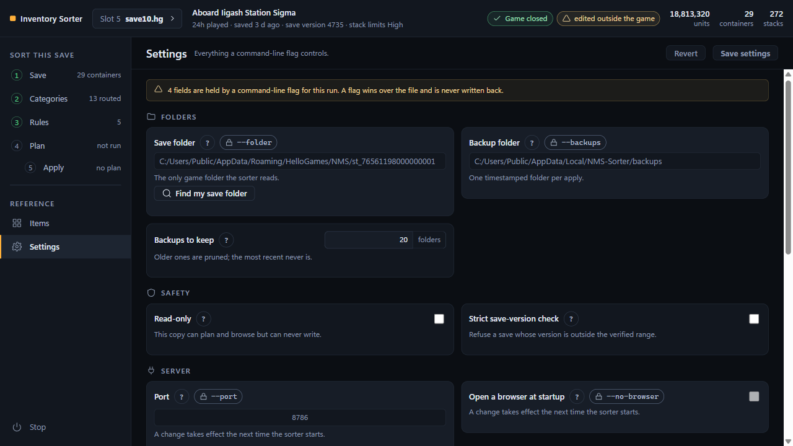

Every field above has a control here, grouped under **Folders**, **Safety** and
**Server**, with one sentence underneath it and the field's full description
from the sorter itself behind the **?** beside its name. Press
**Save settings** to store them, or **Revert** to drop what you have changed;
both stay disabled until something has. The path the file is stored at is
printed at the foot of the section.

A field a flag is holding for this run is shown but **cannot be edited**, and
carries a lock pill naming the flag: a monospace **--backups** beside the
field's name, whose tooltip is the sentence "set by --backups for this run,
given on the command line that started the sorter". One notice at the top of
the section says how many fields are held. Saving the others still works.

`port` and `open_browser` put a banner at the top of the section when you save
them: "Port takes effect on restart. This run keeps the value it started with."

The save folder has a **Find my save folder** button under it. It lists the save folders it
can find in the usual place and offers **use this one** for each, with how many
saves it holds and when the newest was written. It looks in
`%APPDATA%\HelloGames\NMS` and nowhere else, and says so; there is deliberately
no search of the whole machine, because a wrong guess sorts the wrong account.
If a command-line flag is holding the save folder for this run the list still
appears, but there is nothing to press: each row says "a command-line flag is
holding this field for this run".

## 6. Backups, restore and undo

A backup is taken automatically before every apply, and nothing else ever
writes to the backup folder. They live in `%LOCALAPPDATA%\NMS-Sorter\backups\`,
outside the game's own folder, so Steam Cloud never sees them.

The **Backups** card is in the Plan section, below the Apply card. It is
always visible, plan or no plan, because the reason to come looking for it is
usually that an apply has already happened. The line under **Refresh** always
names the folder they are in.

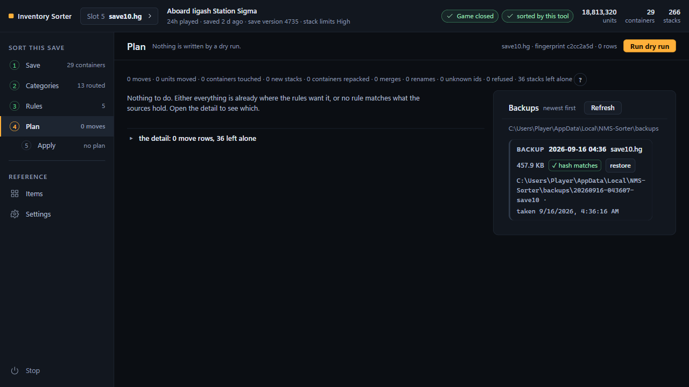

Each row is one backup, newest first: the timestamp, the save file it holds, its
size, and whether its hash still matches.

- **hash matches** means the copy still hashes to what its manifest recorded.
- **hash differs** means it does not, and a restore from it would be refused.
- **hash unknown** is a third answer, not a failure: there is nothing to check
  that copy against.
- **no manifest** marks a folder written by a version that did not keep one.
  Retention leaves those alone rather than pruning them.

The tick is never the only thing carrying the meaning; the words are beside it.

**Restoring.** Press **restore** on a row and it asks on the row itself, naming
both files and the stamp: "Copy save10.hg and mf_save10.hg from the backup
taken 2026-09-14 01:42 back over the save folder? From the main menu, or with
the game closed." While the game is running that question carries the same tick
the Apply card does, **"I am at the main menu, not in a loaded save."**, and
**yes, do it** is greyed out, with "restore is off until the box above is
ticked." under it, until it is ticked. Restore copies those two files
back and writes nothing else, it verifies both hashes against the manifest
before it writes either of them, and it refuses from a loaded save exactly as
apply does. It shows the same list of steps an apply does.

A restore puts back each file's **modification time** as well as its bytes.
That sounds like a detail and is not: a plan is pinned to the save's name, its
size and its timestamp, so a restore that left a fresh timestamp behind would
make the plan you approved before the apply un-reapprovable afterwards.

**Undo.** The result card after an apply carries **Undo this apply**. That is
the same restore, aimed at the backup that apply just took, so there is nothing
to choose and nothing to get wrong. It has no time limit: the backup is a folder
on your disk, and you can restore it from the Backups card next week.

**A restore will not discard play.** The apply records the hashes it left on
disk. If the save has been written since, the restore refuses with a sentence,
and the Backups card asks the same question first, so the button is greyed out
rather than offered and then refused. The reason is printed beside it in words,
not only in a tooltip: "the save has been written since this backup was taken;
restoring would discard that play". When the save still matches, the button's
tooltip says so: "the save folder still holds exactly what this apply wrote".
For a backup taken by a build older than this check, the third answer is
"whether the save changed since cannot be checked", and the button is offered.

`backup_keep` decides how many folders are kept. Pruning never removes the most
recent, and never removes one without a manifest.

## 7. The health panel

The health panel is a fold at the bottom of the Settings section, not a section of its own:
every line in it is a fact about something the controls above set.

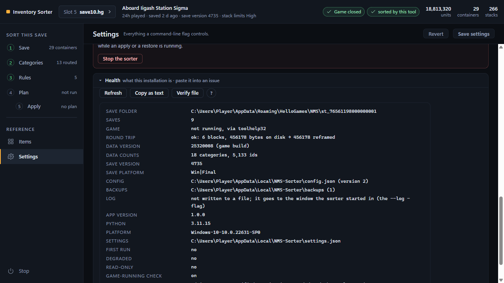

It is what an issue asks for first. **Copy as text** puts the whole block on
the clipboard as `key: value` lines and the panel says "copied as text; paste it
into the issue". If the browser will not hand over the clipboard, the same text
is in a box on the page to select by hand. **Refresh** re-reads it and says
"refreshed".

| Line | What it tells you |
|---|---|
| save folder | the folder this copy reads, and nothing else |
| saves | how many `saveN.hg` files are in it |
| game | running with pids, not running, or unknown with the reason; the method it used is named |
| round trip | whether the selected save re-serialises byte for byte, with the detail. This is step 4 of the write sequence, run without writing. **Verify file**, in the button row above the lines, runs it again on the save you have selected and prints both steps |
| data version | the game build the item table was generated from |
| data counts | how many categories and ids that table holds |
| save version | the `Version` field of the selected save |
| save platform | what the **game** wrote in the save, `Win\|Final` for a Steam save on Windows. Not the same question as `platform` below: this says which build of the game made the file |
| config | the config path and its version |
| backups | the backup folder and how many are in it |
| log | the log file, or that it is going to the window the sorter started in |
| app version, python, platform | this build, this interpreter, this machine |
| settings | the settings file path |
| first run | whether a save folder has been chosen yet |
| degraded | which startup problem put this copy in reduced mode, or no |
| read-only | whether apply is disabled outright |
| game-running check | on, or off with the flag that turned it off |
| save-version check | advisory, or strict if `strict_version_check` is on |
| idle exit | how many minutes, or that it is off |

Two lines are the ones worth reading before you apply anything: **game** and
**round trip**. If the first cannot say whether the game is running, apply will
refuse. If the
second is not ok, apply will refuse at step 4, and that is the refusal to quote
in an issue.

**Verify file** sits beside **Copy as text** in that panel. It decodes the save
you have selected, writes it out again, compares the two byte for byte, and
prints the two steps. It writes nothing. You do not need it in normal use,
because an apply runs the same check itself and refuses; it is worth running
after a game update, after an apply refused at the round-trip step and you want
the offset for an issue, or after another tool has edited the save.

## 8. Five worked configurations

These go into the config file, `%LOCALAPPDATA%\NMS-Sorter\config.json`, or
wherever `--config` points. There is no box on the page to paste JSON into.

**Put the file in place, then press "Reload from disk" on the save bar.** The
config is read once at startup, so a file you edit while the sorter is running
changes nothing until it is re-read. Reload does that, and drops any dry run you
had approved, because a plan printed under the old rules must not stay
approvable. Restarting the sorter does the same job.

**Do not press "Save configuration" first.** That writes the page's copy
straight over what you pasted. If you do, the five previous revisions are beside
the file as `config.json.bak.1` to `.bak.5`, so it is recoverable.

**Each example shows only the keys that differ from the shipped default, and a
key you leave out is empty, not the shipped default.** An example that names no
`item_rules` has none: no keep of 250 Sodium, no rule banking Chromatic Metal.
The dry run's notes list every key filled in that way. `options` is the
exception and keeps its defaults.

Container keys are the one thing you will have to change: a config naming a
chest you have not built is an error. A container's key is in the tooltip of
its card in the Save section, of its row on Categories, and of its line in the
plan, as `Raw Resources (chest1)`. It is printed beside the name only where
two containers in the save read the same name, which is the case it is there
for.

### Ten chests

The shipped layout, written out: one category per chest, food to the Nutrient
Processor, and the two pairs that share a chest.

```json
{
  "config_version": 2,
  "name": "Ten chests",
  "sources": ["suit", "ship0", "freighter", "corvette"],
  "bucket_rules": [
    {"bucket": "raw_resources", "store": "chest1"},
    {"bucket": "refined_crafted", "store": "chest2"},
    {"bucket": "trade_goods", "store": "chest3"},
    {"bucket": "food_ingredients", "store": "cooking"},
    {"bucket": "fish", "store": "chest4"},
    {"bucket": "tech_upgrades", "store": "chest5"},
    {"bucket": "tech_upgrades_elite", "store": "chest6"},
    {"bucket": "utility_consumables", "store": "chest7"},
    {"bucket": "curiosities_artifacts", "store": "chest8"},
    {"bucket": "base_structures", "store": "chest9"},
    {"bucket": "base_decor", "store": "chest9"},
    {"bucket": "ship_construction", "store": "chest10"},
    {"bucket": "salvage_junk", "store": "chest10"}
  ]
}
```

Two kinds of warning are expected here and both are correct. Categories with no
rule are **never routed**: their items stay where they are. And any container
you have not built yet, or a ship you have sold, reads as "not sortable right
now", once per rule that names it. A cargo grid the game merged away says
nothing at all, because there is nothing anybody can do about it. That is a fact about your save rather than a
mistake in the file, which is why it is a warning and does not block the save.

### Freighter only

Everything into the freighter, overflowing into its cargo hold if it has one.
The chain is one field with a list in it, which is version 2's spelling; a
`freighter_cargo` that has no cells is skipped and the items go into
`freighter`.

```json
{
  "config_version": 2,
  "name": "Freighter only",
  "sources": ["suit", "suit_cargo", "ship0"],
  "bucket_rules": [
    {"bucket": "*", "store": ["freighter", "freighter_cargo"]}
  ],
  "never_buckets": ["unsorted"]
}
```

The `*` rule is a catch-all, and `never_buckets` is what keeps it honest: items
the table does not know, and the game's own pseudo-items, are never swept up by
it.

### Minimal: raw materials and technology

Two chests, four categories, nothing else touched. A good first configuration:
small enough to read the whole dry run.

```json
{
  "config_version": 2,
  "name": "Minimal",
  "sources": ["suit", "ship0"],
  "bucket_rules": [
    {"bucket": "raw_resources", "store": "chest1"},
    {"bucket": "refined_crafted", "store": "chest1"},
    {"bucket": "tech_upgrades", "store": "chest2"},
    {"bucket": "tech_upgrades_elite", "store": "chest2"}
  ]
}
```

Every other category is unrouted, so its items stay exactly where they are.
That is the point of starting here. It names no `item_rules`, so it has none.

### Suit floors with a junk box

Keep the four fuels topped up in the suit and put everything else in one chest.
This is the layout the `stock` mode exists for.

```json
{
  "config_version": 2,
  "name": "Suit floors with a junk box",
  "sources": ["suit", "suit_cargo", "ship0", "chest1"],
  "bucket_rules": [
    {"bucket": "*", "store": "chest1"}
  ],
  "never_buckets": ["unsorted"],
  "item_rules": [
    {"item": "CATALYST1", "stock": 250, "stock_in": "suit", "priority": 10,
     "note": "Sodium"},
    {"item": "OXYGEN", "stock": 250, "stock_in": "suit", "priority": 10,
     "note": "Oxygen: life support and refining"},
    {"item": "FUEL1", "stock": 500, "stock_in": "suit", "priority": 10,
     "note": "Carbon"},
    {"item": "ROCKETSUB", "stock": 200, "stock_in": "suit", "priority": 10,
     "note": "Tritium: pulse-engine fuel"}
  ]
}
```

`stock` is two-sided: it tops the suit up to the number **and** refuses to drain
it below it, and the surplus follows the catch-all into the junk box. Note that
`suit` and `chest1` are both sources. The suit has to be one, or there is
nothing to hold back; the chest has to be one, or the surplus can never come
back out of it.

Swap `stock` for `keep` and these become floors that never fetch: they would
hold 250 Sodium back if you were carrying 300, and do nothing at all if you
were carrying 10.

### Extractor drain into one chest

Stellar Extractor cores fill up and stall the extraction. This drains them into
a chest and sorts nothing into them, because nothing ever is.

```json
{
  "config_version": 2,
  "name": "Extractor drain",
  "sources": ["extractor1", "extractor2", "extractor3"],
  "bucket_rules": [
    {"bucket": "raw_resources", "store": "chest1"},
    {"bucket": "refined_crafted", "store": "chest1"}
  ]
}
```

Name one source per core you have, and only as many as you have: `extractor4`
on a three-core base is the ordinary "not a container in this save" error. The
Save section lists them in a fold, with every substance each core holds, and the
count comes from the cores themselves rather than from a guess.

`extractor1` upwards is the order the rooms stand in the freighter, not the
order the buffers happen to sit in the save file, so the same key means the
same extractor after a reload. A room you rebuild keeps its number; the stale
buffer it left behind gets none, is counted under the cards as ignored, and is
never drained.

One caveat. If a room's buffer cannot be identified at all, or a buffer belongs
to no room, the sorter says so on the plan and leaves that one out -- the rest
are still offered and still drain. Both sentences are in
`docs/TROUBLESHOOTING.md`.

Emptied core slots are left at zero rather than deleted, because that slot is
where the next yield lands.

## 9. Keyboard

Everything the mouse can do, the keyboard can. There is no drag-only gesture
anywhere in the page.

**The rail.** Tab reaches the rail as a single stop. Up and Down move between
the six sections, Left and Right do the same, and Home and End jump to the
first and last.

**Routing.** A category with nowhere to go has a "route to..." select in the
**No destination** card, which is a fold: Enter or Space on its heading opens
it. Every container row in the **Destinations** list has a **+** button that
opens an add-a-category select, and every chip in it has a remove button.

**Unrouting.** The remove button on a chip drops that one container.
**Remove from everywhere** at the foot of the No destination card takes a
category off every container at once, and asks first. Dragging a chip back onto
that card does the same thing; neither is the only way.

**Order, and focus after a change.** Sources and rules have up and down
buttons. **Every list in the Categories and Rules sections puts focus back on
the control you pressed**, so an up or down button can be pressed twice without
reaching for the mouse in between.

**Undo.** The save bar carries **Undo last change** as well as the toast, and
unlike the toast it does not expire. If you miss the ten seconds, the button is
still there.

**Containers.** A container card's head is a button. Enter or Space opens it.

**The Items section.** Each row is one Tab stop, not a dozen. Space selects the
row. Left and Right reach its category picker. Up and Down move between rows,
and Home and End jump to the first and last. The table body is a fixed height
with the header staying put, so there is no long list to skip past: the two
pager arrows move the window instead, and focus stays on the arrow you
pressed.

**The category picker on a row has an edit mode**, and this is the one keyboard
convention worth learning. While the cell is only focused, the picker ignores
keys and the arrows move you around the grid. **Enter** or **F2** puts it into
edit mode; then the arrows choose a category, **Enter** keeps it and **Escape**
puts the previous value back. A change you commit leaves an undo on the save
bar. It works that way because a `<select>` owns the arrow keys, and an arrow
press with the cell merely focused used to change the category and write it to
disk.

**Choosing an item.** On a rule that already exists, the item is a button, and
it opens the picker with the search box already focused. Type to filter, Up and
Down to move, Enter to choose, Escape to close. Focus returns to the row you
started from.

**Adding a rule.** The **"Add a rule for"** field is a different control: you
type into it and a list drops down under it. Up and Down move through the list,
Enter picks. **Add rule** beside it is off until an item is named, and the
sentence next to it says so.

**The save picker.** It is a button. Enter, Space or Down opens the list of
saves, the arrows move through it, Enter chooses, and Escape closes it and puts
focus back on the button.

**A `?`** is a button too. Pressing it prints its sentence under the control it
belongs to; Escape closes it and hands focus back.

**Numbers.** Focusing a number field selects the whole value, so you retype it
rather than nudging it.

**Confirmations.** They open with "no" focused. Escape cancels and returns focus
where it was.

**Filters.** Filter chips are buttons, and each says whether it is on.

**A disabled button says why**, in a sentence beside it rather than in a
tooltip: "apply is off until a dry run has been read", "apply is off until both
boxes are ticked", "restore is off until the box above is ticked", "add a rule
is off until an item is named above". A `title` on a disabled button reaches
nobody,
because a disabled button cannot be focused or usefully hovered.

Every control shows a visible amber focus ring. Nothing you have to read is
under 12 px or dimmer than 4.5:1 against its panel.

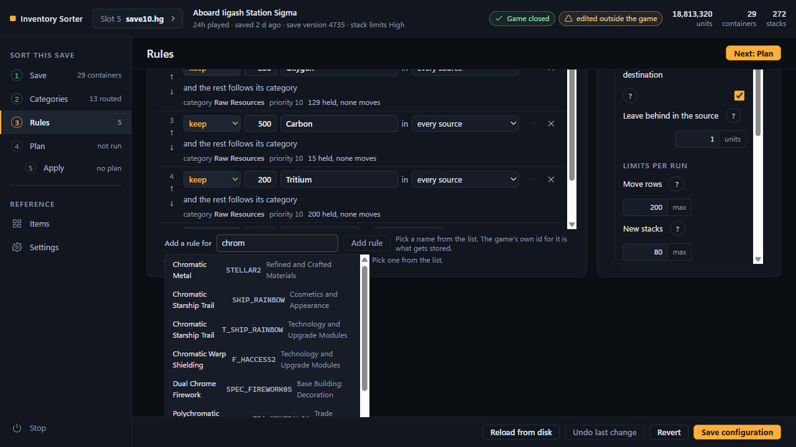

## 10. Stopping it

Four ways, all the same thing: the local server stops answering and the process
ends. **Nothing is written to your save when the sorter stops**, and nothing is
cleaned up either: your settings, your configuration and every backup stay
exactly where they are.

**The button.** At the foot of the Settings section, in a danger block of its
own: **Stop the sorter**. A quiet copy sits at the bottom of the rail. It
asks once ("Stop the sorter? The page will stop answering and you can close
this tab. Nothing is written."), and then the whole page is replaced by one
sentence, because every control on it was talking to a server that has gone:

> The sorter has stopped. Close this tab. Double-click NMS-Sorter.exe to start
> it again.

**The entry in the rail.** **Stop**, separated at the foot of the rail below
Items and Settings; a screen reader announces it as "Stop the sorter (from the
rail)", so it cannot be confused with the button in Settings. Same question,
same result, from whichever section you are on.

**ctrl-c.** If you started the sorter from a window -- `packaging\start.bat`,
`python -m nms_sorter`, or `NMS-Sorter-console.exe` -- ctrl-c in that window
stops it, and so does closing the window. `NMS-Sorter.exe` has no window, which
is why the two page controls above exist.

**By itself, when nothing is using it.** The sorter stops after
`idle_exit_minutes` minutes with no request from the page, 30 by default. The
page asks the sorter something every 15 seconds while it is open, so an open tab
never times out; a tab you closed, or a browser you quit, does. Set
`idle_exit_minutes` to 0 in the Settings section to switch it off. The change takes
effect immediately, and the health panel says which way it is set.

**The one refusal.** Stopping is refused while an apply or a restore is running:

> an apply or restore is running; wait for it to finish, then stop the sorter

Wait for the steps in the Plan section to finish and press stop again. The
write is not in danger either way, but a stop that landed in the middle of one
would leave you reading half a report.

**Starting it again.** Double-click `NMS-Sorter.exe`. If one is already
running, the copy you just started opens that one's page and closes itself,
saying so: "another copy of the sorter was started and closed itself; this is
the running one". You get one server however many times you double-click.

**Task Manager** is the last resort and should never be needed: end
`NMS-Sorter.exe`. It is safe in the sense that a save is written in one atomic
replace with a backup taken first, so there is no half-written save to inherit;
what you lose is the plan you had approved.
